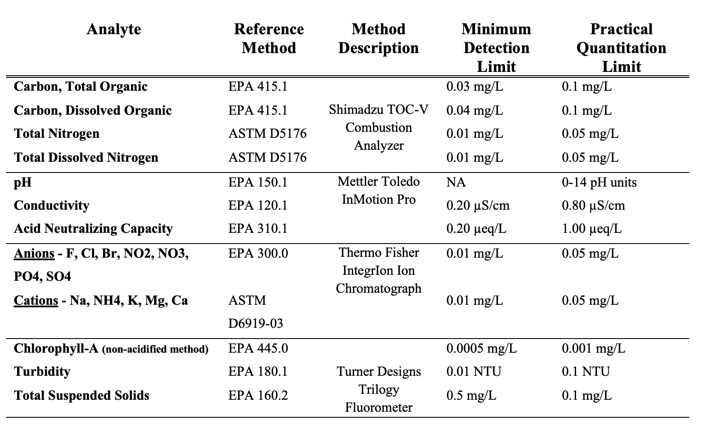

# ROSS Cache la Poudre Water Quality Data

Current release: (2021- 11/2024)

Authors: Samuel J. Struthers (<https://orcid.org/0000-0003-1263-9525>),Timothy S. Fegel, Kathryn R. Willi (<https://orcid.org/0000-0001-7163-2206>), Charles C. Rhoades (<https://orcid.org/0000-0002-3336-2257>), Matthew R.V. Ross (<https://orcid.org/0000-0001-9105-4255>)

## **Data Description:**

The majority of this dataset is water chemistry grab sample data collected in the Cache la Poudre (CLP) Watershed between the years of 2021 and 2024. This dataset also includes historical mainstem CLP data collected by the Rhoades lab at the US Forest Service Rocky Mountain Research Station. These data are focused on basic water quality parameters, as well as cations and anions. Data were collected across the CLP watershed at various high elevation reservoirs, the mainstem of the Cache la Poudre River, and select tributaries to the CLP river. This project is ongoing and additional data will be released as it is analyzed.

## **Background Information:**

This dataset is an aggregation of all water quality grab samples collected by the Radical Open Science Syndicate (ROSS, ROSSyndicate), combining data from two ongoing studies: **Cameron Peak Fire Study** and **Lower Poudre Water Quality Network**

### Cameron Peak Fire Study

The 2020 Cameron Peak wildfire (CPF) was the largest wildfire in Colorado history at over 200,000 acres. The CPF burned a large proportion of the Cache la Poudre watershed, in particular areas surrounding high elevation reservoirs. This work is funded to support ongoing source water protection programs by the City of Fort Collins, Greeley, Thornton and Northern Water. In collaboration with the Rocky Mountain Research Station (USFS, RMRS), we are sampling various reservoir, tributary, and mainstem sites of the Cache la Poudre watershed. This field campaign allows us to analyze trends in water quality focusing on nutrients and other key constituents mobilized post-fire. The goal of this project is to understand how these nutrients affect algal growth in reservoirs and how those changes are propagated downstream. The reservoirs studied are the following: Barnes Meadow Reservoir, Chambers Lake, Comanche Reservoir, Hourglass Reservoir, Joe Wright Reservoir, Long Draw Reservoir, and Peterson Lake. Historical data (prior to 2021) was collected by the Rhoades Lab at the USFS' Rocky Mountain Research Station.

### Lower Poudre Water Quality Network

Following a fish kill in the Poudre River in Fort Collins in 2018, the ROSSyndicate at CSU and the City of Fort Collins partnered to deploy water quality sensors thoughout the the Lower Poudre River (below the Poudre Canyon mouth to Windsor). The goal of this work is to understand how agricultural practices and urban storm water management influence water quality in the Poudre River, as well as tracking potential future water impairments or fish kills. In 2023, ROSSyndicate began working with collaborators at the University of Colorado Boulder to collect grab samples and deploy additional sensors to investigate drivers of water quality and build correlations betweeen water chemistry data and in situ water sensors. Water quality grab samples were analyzed by Biogeochemistry lab at the US Forest Service Rocky Mountain Research Station. In situ water sensor data are **not** included in this dataset. 

## Data Organization

The primary data file is `data/cleaned/CLP_chemistry_up_to_202401113`. Column definitions and units are defined in the file `metadata/water_chemistry_units.xlsx`. Methods used to collect these data are outline below or in `metadata/rmrs_procedures.png`

Location metadata file is `data/metadata/location_metadata.csv`. Two basic maps showing all sampling locations are available in the `maps` folder. Data are housed in the `data` folder and it contains the following:

-   `cleaned`: This folder contains the most recently available dataset and has associated burn severity and location data added to the chemistry data. The addition of the metadata was accomplished using the `01_chem_prep.qmd` R script.

-   `cleaned_archive`: This folder contains an archive of previously cleaned data. Downstream users are encouraged to use the collated data file `data/cleaned/CLP_chemistry_up_to_202401113` in the `cleaned` directory.

-   `raw`: These data were directly received by the ROSSyndicate from RMRS lab managers. Downstream users are encouraged to use the collated data file `data/cleaned/CLP_chemistry_up_to_202401113` in the `cleaned` directory.

-   `metadata`: this contains location data, parameter/column name definitions, units, and methods used at the RMRS Lab. The `README` file in this folder explains burn severity classifications used in the files `sbs_watershed.csv`,`sbs_watershed.csv` and `location_metadata.csv`

## Code Organization

Code is housed in the `scripts` folder and is primarily used for reference. Downstream users should not need to use files other than `demo.R` to use the dataset. This folder contains the following files:

-   `00_setup.R` provides loads packages and metadata files to be collated in `01_chem_prep.qmd`.

-   `01_chem_prep.qmd` adds metadata to most recent .csv of water chemistry data supplied by RMRS lab.

-   `distance_finder.R` uses NHDflowlines to calculate distances in the Upper watershed from furthest downstream site, PBD.

-   `sites_map.R` uses location metadata to create `upper_sites_map.html` and `lower_sites_map.html`

-   `demo.R` provides an example of how to download data from Zenodo directly in RStudio

## Methods for Data Collection

Field measurements were taken using a Thermo Orion Star with RDO Optical and Conductivity probes. Times, when present, are listed in MST. Samples were collected and processed using the Rocky Mountain Research Station's Biogeochemistry Lab, overseen by Timothy Fegel and Charles Rhoades, according to the following methods:

**Funding:** The Cameron Peak Fire portion of this dataset was funded by the City of Fort Collins Utilities, City of Greeley Utilities, City of Thornton Utilities and Northern Water. The Lower Poudre Water Quality Network portion was funded by the Thomas' lab at the University of Colorado Boulder, in-kind support was given by In Situ Inc, ROSSyndicate at CSU and RMRS biogeochemistry lab.

**Keywords**: Cameron Peak Fire, water quality, reservoirs, chlorophyll a, biogeochemistry, Cache la Poudre, Poudre Water Quality Network, ROSSyndicate, water quality, agriculture, urban impacts to water quality

**Version**: v2024.12.04
